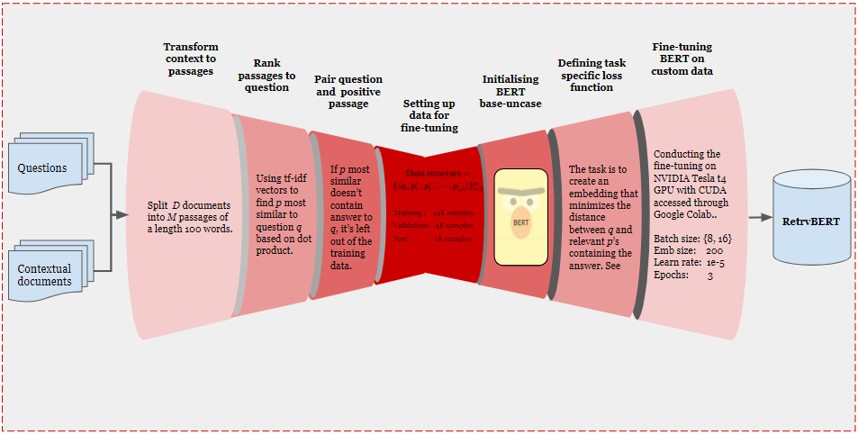

# ODQA
## Deep learning project: Open-Domain Question Answering Retrieval Model

### Introduction
Open-domain question answering (ODQA) relies on efficient passage retrieval to select candidate contexts. Retrieval can be implemented using dense representations learned by pretrained transformer models. These models are highly expressive, comprising millions of parameters and a dozen layers. 

In this project we pick the BERT model and seek to fine-tune it. We vary the number of final layers that are fine-tuned and optimize by the negative log-likelihood of the positive passage.

### Data-sets
For this work the [Trivia QA dataset](https://huggingface.co/datasets/trivia_qa) has been examined. It contains +200K pairs of questions and answers together with contextual documents.

### Key contributions
* Comparison of three distinct ways of fine-tuning the [BERT base uncased model](https://huggingface.co/bert-base-uncased).
* Task specific loss function applied to create a vector space such that relevant pairs of questions and passages will be related.

### Pre-processing
Each question $q_{i}$ is paired with a positive passage $p_{i}$. The positive passage is obtained by splitting the contextual documents into passages of **100 words**. Passages are ranked by its distance to the question using the dot product of the TF-IDF embeddings as the distance metric. 

The shortest distance passage that also contains the answer is selected as $p^{+}$. By having pairs ($q_{i}$ ,$p^{+}_{i}$), we relate questions to negative passages for training, by selecting an arbitrary number of random selected positive passages paired with other questions which appear in the training data.

### Loss function
The model is trained to optimize the negative log likelihood of the positive passage. This metric is applied to create a vector space such that the distance between pairs of questions and relevant passages will be smaller.

}}{e^{\operatorname{sim}\left(q_{i},&space;p_{i}^{p}\right)}&plus;\sum_{j=1}^{n}&space;e^{\sin&space;\left(q_{i},&space;p_{i,&space;j}^{-}\right)}},&space;\text&space;{where&space;}&space;\operatorname{sim}(q,&space;p)=E_{Q}(q)^{\top}&space;E_{P}(p)&space;\end{equation})

### RetrvBERT
The pipeline used to fine-tune BERT base-uncased. We call the output **RetrvBERT**.

